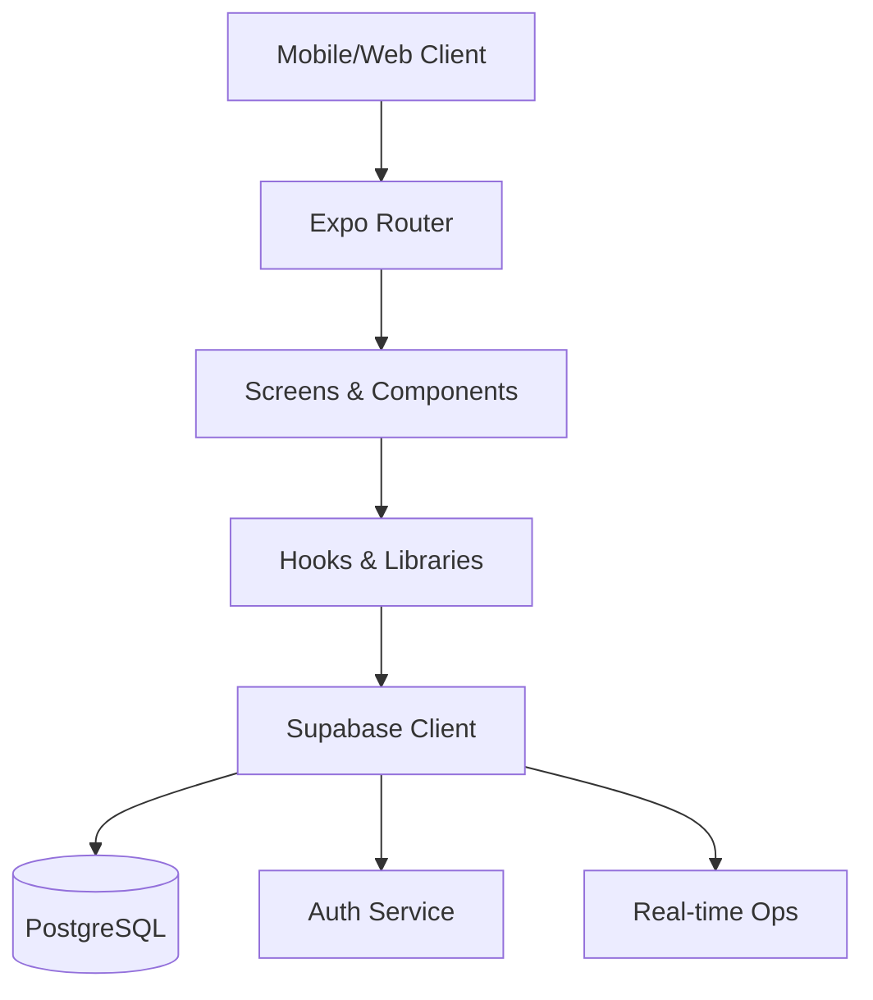

<div align="center">
  

  # 🌙 Lunavo Platform
  **Empowering Student Wellness and Peer Support at CUT**

  [](https://expo.dev/)
  [](https://reactnative.dev/)
  [](https://supabase.com/)
  [](https://www.typescriptlang.org/)

  [Quick Start](#-quick-start) • [Features](#-key-capabilities) • [Documentation](#-documentation-hub) • [Architecture](#-system-architecture)
</div>

---

## 🌟 Vision
**Lunavo** is a state-of-the-art, student-centric support ecosystem engineered specifically for **Chinhoyi University of Technology (CUT)**. It bridges the gap between students, peer educators, and professional counselors, providing a safe, intelligent, and real-time environment for mental wellness, crisis intervention, and academic community building.

---

## 🚀 Key Capabilities

### 🛡️ Crisis & Safety
- **Intelligent Crisis Detection**: Real-time AI analysis of forum posts to detect and escalate distress signals.
- **Immediate Escalation**: Automated protocols connecting students to professional counselors within seconds.

### 🤝 Peer & Professional Support
- **Peer Educator Network**: Verified student support systems for relatable guidance.
- **Professional Counseling**: Integration with university counseling services for clinical support.
- **Live Chat**: Secure, real-time messaging between students and support staff.

### 🎮 Engagement & Growth
- **Gamified Wellness**: Earn badges and points for positive engagement and community support.
- **Resource Repository**: A curated hub of mental health, academic, and life-skill materials.
- **Real-time Forums**: Dynamic community spaces categorized by AI for maximum relevance.

---

## 🛠️ Technology Stack

| Layer | Technology | Purpose |
| :--- | :--- | :--- |
| **Frontend** | React Native + Expo | Cross-platform (iOS, Android, Web) performance. |
| **Backend** | Supabase | Real-time DB, Auth, and Secure Storage. |
| **Navigation** | Expo Router | File-based routing for seamless UX. |
| **UI/UX** | React Native Paper | Material Design 3 compliant components. |
| **Logic** | TypeScript | Type-safe, robust application architecture. |

---

## 📦 System Architecture



---

## 📖 Documentation Hub

We maintain comprehensive documentation for developers, administrators, and contributors.

### 🏁 Getting Started
- [**Installation & Setup Guide**](docs/wiki/Getting-Started/Installation-and-Setup.md)
- [**Supabase Configuration**](docs/wiki/Getting-Started/Supabase-Setup.md)
- [**Database Migration**](docs/wiki/Getting-Started/Database-Migration.md)

### 👨‍💻 Development
- [**Developer Reference**](docs/guides/DEVELOPER_GUIDE.md) - Our "Source of Truth" for development.
- [**Architecture Overview**](docs/wiki/Development/Architecture.md)
- [**Role-Based Access Control**](docs/features/ROLE_BASED_NAVIGATION_IMPLEMENTATION.md)

### 📈 Reports & Status
- [**Project Completion Report**](docs/reports/PROJECT_COMPLETION_REPORT.md)
- [**Implementation Timeline**](docs/wiki/Implementation-Status/Phases.md)
- [**Current Status: 85% Complete**](docs/reports/IMPLEMENTATION_STATUS.md)

---

## ⚡ Quick Start

### 1. Prerequisites
- Node.js (v18+)
- Expo Go app on your mobile device
- Supabase Account

### 2. Installation
```bash
# Clone the repository
git clone https://github.com/PraiseTechzw/Lunavo.git

# Navigate to project
cd Lunavo

# Install dependencies
npm install
```

### 3. Environment Setup
Create a `.env` file in the root directory:
```env
EXPO_PUBLIC_SUPABASE_URL=your_supabase_url
EXPO_PUBLIC_SUPABASE_ANON_KEY=your_supabase_anon_key
```

### 4. Run the Application
```bash
# Start Expo development server
npm start

# For specific platforms
npm run android
npm run ios
npm run web
```

---

## 🔐 User Roles

The platform features a sophisticated **8-tier Permission System**:

1. **Student**: Access to community, resources, and basic support.
2. **Peer Educator**: Verified students assisting their peers.
3. **PE Executive**: Managing the peer educator network.
4. **Moderator**: Ensuring community safety and standards.
5. **Counselor**: Licensed professional mental health support.
6. **Life Coach**: Guidance for personal development.
7. **Student Affairs**: Data-driven insights and trend analysis.
8. **Admin**: Full system orchestration.

---

<div align="center">
  <sub>Built with ❤️ by the Lunavo Team. © 2026 Lunavo Platform.</sub>
</div>
